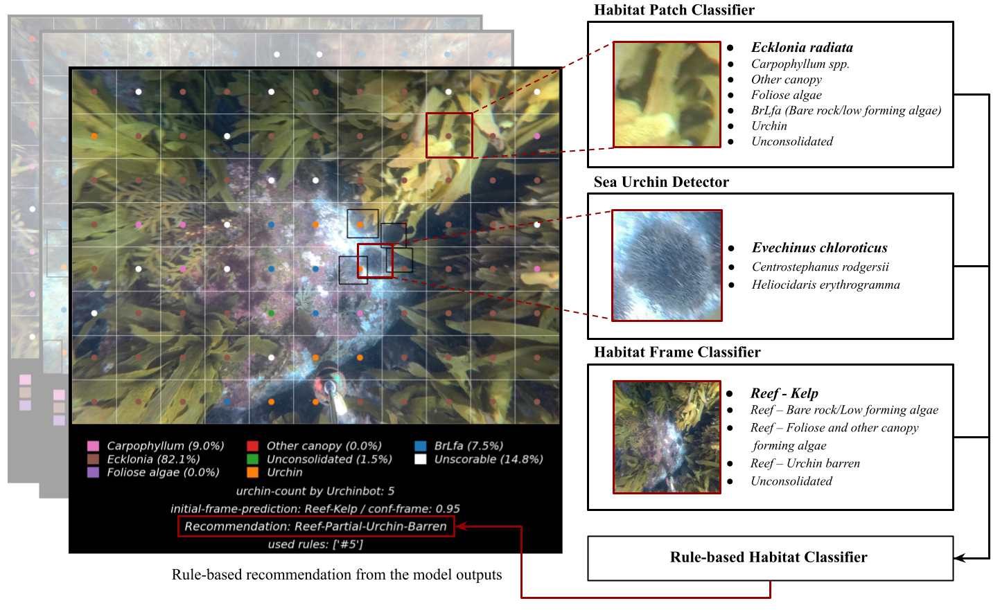

# Habibot: A multi-model machine learning approach for rapid classification of temperate rocky reef ecosystems from underwater imagery

Rapid, scalable assessment of temperate rocky reef habitats is essential for detecting ecosystem change and guiding management, yet analysis of underwater imagery remains a major bottleneck due to the cost and limitations of human annotation. We present Habibot, an open-source, multi-model machine learning pipeline that integrates (i) a frame-level habitat classifier, (ii) a patch-level classifier derived from point-based annotations, and (iii) an explicit sea urchin detector to produce transparent, ecologically grounded habitat assessments. Habibot targets common reef states across northeastern New Zealand and southeastern Australia, including kelp- and seaweed-dominated reefs, urchin barrens, and unconsolidated substrates, and additionally flags two heterogeneous partial (mixed) reef states designed to capture early or transitional conditions. Using transfer learning for both frame and patch classifiers and a rule-based fusion stage informed by ecological indicators (frame confidence, patch composition, and urchin presence), the system achieves strong per-model performance on the test sets (mean F1 score = 0.87 for frame classification; mean F1 score = 0.88 for patch classification). End-to-end evaluation on an independent set of 295 images assessed by three marine ecologists yielded 90.5% accuracy. We further demonstrate how Habibot outputs support spatially explicit transect mapping and label-agnostic region highlighting for downstream coverage estimation. Habibot provides a practical, interpretable pathway to accelerate habitat classification workflows and enable timely monitoring of kelp-forest change and urchin impacts from heterogeneous underwater imagery.

<p align="center">
  
</p>

## Installation

### 1. Clone Habibot

```bash
git clone https://github.com/shahrokh1106/Reef-Habitat-Classification.git
cd <repo-folder>
```
### 2. Create and activate a Conda environment
```bash
conda create -n habibot python=3.9.19 -y
conda activate habibot
```
### 3. Set up Urchin-Detector (sea urchin detector)

Habibot uses **Urchinbot**, a YOLOv5 model from the [Urchin-Detector](https://github.com/kraw084/Urchin-Detector) project. Clone it **inside the Habibot repository root** and follow their instructions:

```bash
git clone https://github.com/kraw084/Urchin-Detector.git
```
Confirm the default Habibot weight file is present:
```
Urchin-Detector/models/yolov5m_helio/weights/best.pt
```
This path is used by `python/get_yolo_model.py`. You do **not** need to download the full Urchin-Detector training dataset unless you plan to retrain the detector.

### 4. Install Habibot dependencies

From the repository root:

```bash
pip install -r requirements.txt
```

PyTorch and TorchVision are provided by the Urchin-Detector setup (step 3). Use a GPU build of TensorFlow if available on your system; CPU-only inference also works but will be slower.

### 5. Add trained frame and patch classifiers

Pre-trained weights are **not** included in this repository. Download the archive and extract it at the repository root:

**[trained_classifiers.rar (Google Drive)](https://drive.google.com/file/d/1CN2wHIh65n7N0Dorn4fz9eYwzFeEVz_2/view?usp=sharing)**

After extracting, you should have:

```
trained_classifiers_/frame_classifier/    # frame_classifier.h5
trained_classifiers_/patch_classifier/    # patch_classifier.h5
```

### 6. Verify the installation
From the repository root:
```bash
python python/demo.py
```
If setup is correct, the script loads the frame classifier, patch classifier, and Urchin-Detector, runs an example image, and writes the output figure in fig folder.

### 7. Download and prepare datasets (training and evaluation)

To download annotation data, build train/validation/test splits, and prepare frame and patch datasets for training or evaluation, see **[DATASET.md](DATASET.md)**.

### 8. Train frame and patch classifiers (optional)

Requires prepared datasets ([DATASET.md](DATASET.md)). Run from the repository root.

**Patch classifier**

```bash
python python/trainer_supervised_patch_classifier.py
```

As in the paper, training drops `Mobile invertebrate`, `Unscorable`, and `Sessile invertebrate community`, and merges `Bare rock`, `Turf`, `Encrusting algae`, and `Filamentous algae` into **grazed rock** (later **BrLfa** in the Habibot pipeline; see `remove_classes` and `to_be_combined` in `trainer_supervised_patch_classifier.py`).

By default the script trains **`convnextB`** with **`full_training_flag=True`**. Output: `backbone_selection_results_patch/best_backbone_full_training/convnextB/`

To compare backbones as in the paper, set `model_names` to  
`["inception","efficient", "efficientL", "resnet","convnextB","convnextS","xception","densenet","inception_resnet"]` and **`full_training_flag=False`** in `backbone_finder()`.

**Frame classifier**

```bash
python python/trainer_supervised_frame_classifier.py
```

As in the paper, training uses five classes from `dataset/frame7_dataset_cleaned/`.

By default the script trains **`inception_resnet`** with **`full_training=True`**. Output: `backbone_selection_results_frame/best_backbone_full_training/inception_resnet/`

To compare backbones as in the paper, set `model_names` to  
`["inception","efficient", "efficientL", "resnet","convnextB","convnextS","xception","densenet","inception_resnet"]` and **`full_training=False`** in the `if __name__ == '__main__':` block.

### 9. Evaluate frame and patch classifiers

You need the **test splits** from [DATASET.md](DATASET.md) (`dataset/patches/` and `dataset/frame7_dataset_cleaned/`) and **trained weights** from step 5 (or your own `.h5` from step 8). Point `frame_model_path` and `patch_model_path` in `python/get_evaluation_patch_frame.py` at your files (defaults expect `trained_classifiers/`).

From the repository root:

```bash
python python/get_evaluation_patch_frame.py
```

**Frame classifier (default in script)**

- Data: `dataset/frame7_dataset_cleaned/` (test split)
- Model: `frame_model_name = "inception"`, weights path set by `frame_model_path`
- Output (next to the `.h5` file): `classification_report_frame_classifier_inception.png`, `confusion_matrix_frame_classifier_inception.png`, plus accuracy and macro-averaged metrics printed to the terminal

**Patch classifier (default in script)**

- Data: `dataset/patches/` (test split; same class removal/merge as training)
- Model: `patch_model_name = "convnextB"`, weights path set by `patch_model_path`
- Output (next to the `.h5` file): `classification_report_patch_classifier_convnextB.png`, `confusion_matrix_patch_classifier_convnextB.png`, plus accuracy and macro-averaged metrics printed to the terminal
